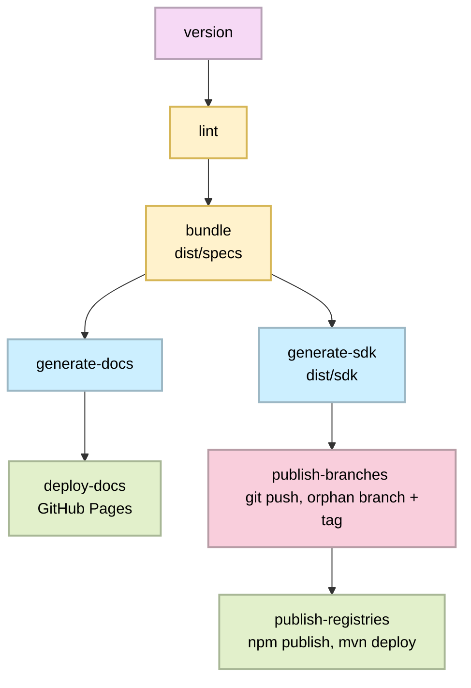

# OctalMesh API Contracts

This repository is the source of truth for the e-commerce platform's OpenAPI 3.1
contracts. Each service is modularized under `specs/<service>` and served
through Tyk.

## SDK publishing scheme

### Naming

| What                                                      | Pattern                                           | Example (service: `auth`)                     |
|-----------------------------------------------------------|---------------------------------------------------|-----------------------------------------------|
| Service repo (for the actual microservice, not this repo) | `ows-svc-<name>`                                  | `ows-svc-auth`                                |
| npm package                                               | `@octalmesh/web-shop-<name>-client`               | `@octalmesh/web-shop-auth-client`             |
| Maven groupId / artifactId                                | `com.octalmesh.web.shop.<name>` / `<name>-<kind>` | `com.octalmesh.web.shop.auth` / `auth-server` |
| Go module path (constant across all branches)             | `github.com/octalmesh/ows-contracts`              | same for every service/branch                 |
| Publishing branch                                         | `sdk/svc-<name>/<lang>-<kind>`                    | `sdk/svc-auth/go-client`                      |
| Git tag                                                   | `svc-<name>-<lang>-<kind>-v<version>`             | `svc-auth-go-client-v1.4.0`                   |

### Pipeline (`.github/workflows/release.yml`)

Triggered on push to `release` (i.e. when `dev` is promoted), or manually.



- **`generate-sdk`** (`tools/scripts/generate-sdk.ts`) runs
  `openapi-generator-cli` once per `(service, lang, kind)` pair from
  `contracts.config.ts`, patches `go.mod` / `package.json` /
  `pom.xml`, stamps a `VERSION` file, and writes a generated
  implementation-guide `README.md`. Everything lands in `dist/sdk/`.

- **`publish-branches`** (`tools/scripts/publish-sdk.ts`) takes each
  `dist/sdk/<service>/<lang>-<kind>` directory, creates a throwaway
  `git worktree` for its orphan branch (`sdk/svc-<service>/<lang>-<kind>`),
  replaces the branch content wholesale, commits, tags, and pushes. This
  runs entirely against isolated worktrees, so it never touches the
  checkout that ran `generate-sdk`. Re-running with an unchanged spec is a
  no-op (tag already exists on origin -> skipped).

- **`publish-registries`** (`tools/scripts/publish-registries.ts`) only
  handles the two targets that actually have a registry: `npm publish` for
  the TypeScript client, `mvn deploy` for the Java server stubs (both
  against GitHub Packages, credentials wired up by `actions/setup-node`
  and `actions/setup-java` in the workflow). Go packages are skipped here
  on purpose - see below.

### Local usage

```bash
pnpm install
pnpm run lint         # lint -> src/specs
pnpm run build        # bundle -> dist/specs
pnpm run generate     # generate -> dist/sdk (all 4 targets x 5 services)
pnpm run docs:preview # generate and preview the docs locally (dist/docs)

# Dry-run the branch/tag publishing without pushing anything:
SDK_VERSION=0.1.0-local pnpm run publish:sdk -- --dry-run
```
