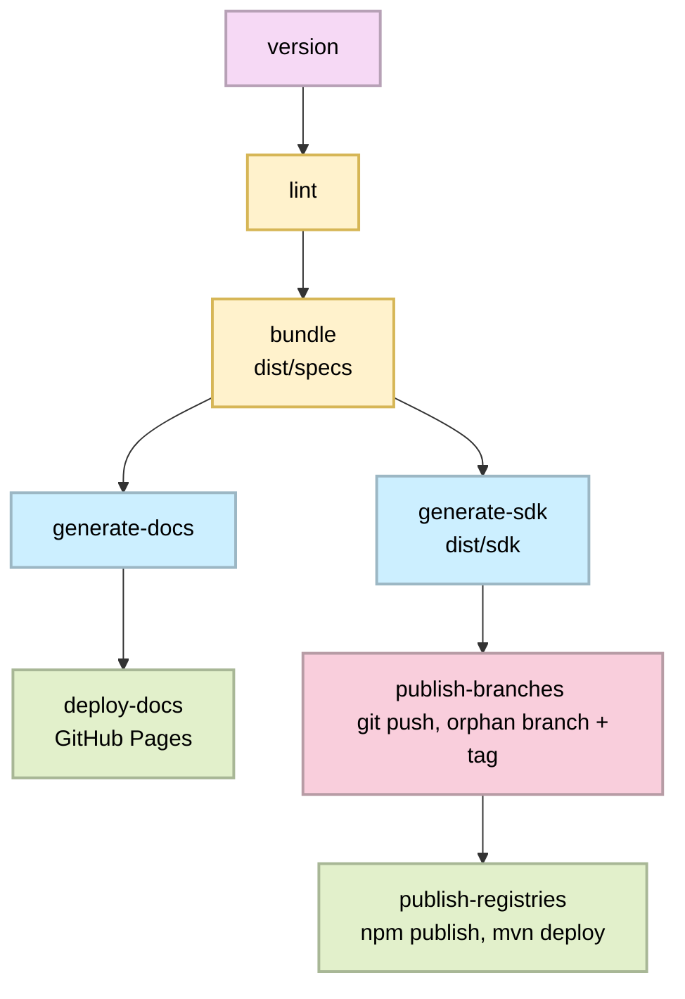

# OctalMesh API Contracts

This repository is the source of truth for the e-commerce platform's OpenAPI 3.1
contracts. Each service is modularized under `specs/<service>` and served
through Tyk.

Linting, bundling, SDK generation, docs, and publishing are all driven by
[**seagull**](https://github.com/OctalMesh/seagull) (`@octalmesh/seagull`) -
a shared CLI used across OctalMesh's contract repos, so a fix or a new
generator lands everywhere by bumping one dependency instead of copy-pasting
tooling between modules.

## Configuration

Everything seagull needs - which services exist, which SDK artifacts to
generate for each, naming, paths, docs site metadata - lives in one file:
**`seagull.yaml`** at the repo root. It's validated against a schema on
every run, so a typo or a missing field fails immediately with a readable
error instead of surfacing three steps later as a broken generator
invocation.

It has three parts:

- **`generators:`** - reusable "recipes": a tool (`openapi-generator` or
  `openapi-typescript`) plus how to invoke it (which `-g` template, naming
  templates for the npm package / Go module / Maven coordinates,
  `additionalProperties`).
- **`contracts:`** - one entry per service. Each picks which of the
  generators above it wants, by id, under `artifacts:`. Two services don't
  have to use the same generators - a contract can also reference a
  generator with a per-contract override (different `additionalProperties`,
  a different `-g` template, etc.) instead of duplicating the whole recipe:

  ```yaml
  contracts:
    - name: payment
      artifacts:
        - generator: java-client
          as: java-client-legacy # renames this artifact's output folder/branch
          overrides:
            generator: java-legacy-template
            additionalProperties: { library: jersey2 }
  ```

- **`vars:`** - a free-form tree for anything used in naming templates
  (`org`, `platform`, `module`, ...). Any string field in `generators:` may
  reference `{vars.some.nested.key}`, `{github.owner}`, `{github.repo}`, or
  `{service}` (the current contract's `name`).

`redocly.yaml` is generated from `seagull.yaml` + the hand-authored
`redocly.base.yaml` (which only holds `extends`/`rules`) - don't edit
`redocly.yaml` directly, it's regenerated on every `lint`/`build`/`generate`
run and is gitignored.

### Custom README templates

Generated SDK packages get a `README.md` - by default a built-in template
per language/kind, but any generator can point `readme:` at a template file
instead, kept in [`readme-templates/`](./readme-templates) at the repo
root (see `generators.ts-client.readme` in `seagull.yaml` for the example
wired up here). Template files support the same `{...}` placeholders as
naming templates, plus `{version}`, `{title}`, and `{artifact.*}` - see the
[Seagull README](https://github.com/OctalMesh/seagull#custom-readme-templates)
for the full placeholder list.

## SDK publishing scheme

### Naming

| What                                                      | Pattern                                           | Example (service: `auth`, artifact: `go-client`) |
|-----------------------------------------------------------|---------------------------------------------------|--------------------------------------------------|
| Service repo (for the actual microservice, not this repo) | `ows-svc-<name>`                                  | `ows-svc-auth`                                   |
| npm package                                               | `@octalmesh/web-shop-<name>-client`               | `@octalmesh/web-shop-auth-client`                |
| Maven groupId / artifactId                                | `com.octalmesh.web.shop.<name>` / `<name>-<kind>` | `com.octalmesh.web.shop.auth` / `auth-server`    |
| Go module path (constant across all branches)             | `github.com/octalmesh/ows-contracts`              | same for every service/branch                    |
| Publishing branch                                         | `sdk/svc-<name>/<artifact-id>`                    | `sdk/svc-auth/go-client`                         |
| Git tag                                                   | `svc-<name>-<artifact-id>-v<version>`             | `svc-auth-go-client-v1.4.0`                      |

`<artifact-id>` is whichever id the contract listed under `artifacts:` in
`seagull.yaml` (defaults to the referenced generator's own id, e.g.
`ts-client`, `go-server`, `java-client`) - see
[Configuration](#configuration) above.

### Pipeline (`.github/workflows/release.yaml`)

Triggered on push to `release` (i.e. when `dev` is promoted), or manually.



- **`generate-sdk`** (`seagull generate`) reads `seagull.yaml`, and for
  every `(contract, artifact)` pair resolves the right generator
  (`openapi-generator-cli` or `openapi-typescript`), runs it, patches
  `go.mod` / `package.json` / `pom.xml` as needed, stamps a `VERSION` file,
  and writes a `README.md` (custom template if configured, otherwise a
  built-in default - see [Configuration](#custom-readme-templates)).
  Everything lands in `dist/sdk/`.

- **`publish-branches`** (`seagull publish sdk`) takes each
  `dist/sdk/<contract>/<artifact-id>` directory, creates a throwaway
  `git worktree` for its orphan branch (`sdk/svc-<contract>/<artifact-id>`),
  replaces the branch content wholesale, commits, tags, and pushes. This
  runs entirely against isolated worktrees, so it never touches the
  checkout that ran `generate-sdk`. Re-running with an unchanged spec is a
  no-op (tag already exists on origin -> skipped).

- **`publish-registries`** (`seagull publish registries`) only handles the
  targets that actually have a registry: `npm publish` for the TypeScript
  client/server-types packages, `mvn deploy` for the Java client/server
  packages (both against GitHub Packages, credentials wired up by
  `actions/setup-node` and `actions/setup-java` in the workflow). Go
  packages are skipped here on purpose - see above.

### Adding a service or SDK artifact

Both are `seagull.yaml`-only changes, no script edits needed:

- **New service**: add its `specs/<name>/openapi.yaml`, then a matching
  entry under `contracts:` in `seagull.yaml` (name, title, entrypoint, which
  `artifacts:` it wants).
- **New/changed generator**: add or edit an entry under `generators:`, then
  reference its id from whichever contracts' `artifacts:` list should use
  it - or override it per-contract, see [Configuration](#configuration).

This is the same `seagull.yaml` shape every other OctalMesh contracts repo
uses - a fix or a new generator recipe worth sharing goes into
`@octalmesh/seagull` itself, then gets picked up here on the next version
bump.

### Local usage

```bash
pnpm install
pnpm run lint         # lint -> specs/
pnpm run build        # bundle -> dist/specs
pnpm run generate     # generate -> dist/sdk (all artifacts x all contracts, per seagull.yaml)
pnpm run docs:preview # generate and preview the docs locally (dist/docs)

# Dry-run the branch/tag publishing without pushing anything:
SDK_VERSION=0.1.0-local pnpm run publish:sdk -- --dry-run
```
